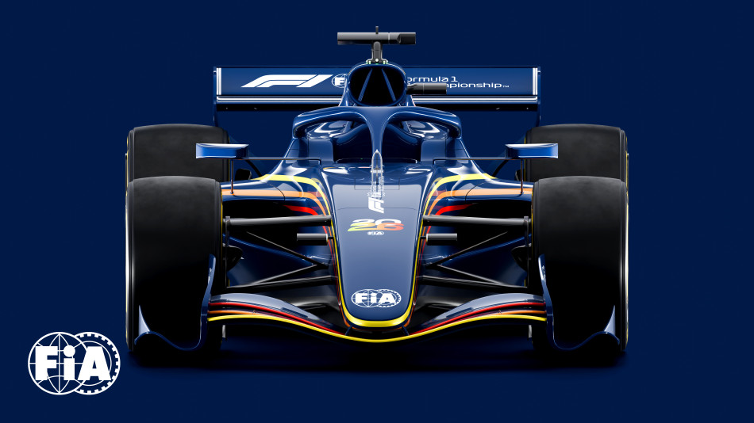

# F1 Aero Performance Analyzer

<p align="center">
  
  
  
  
</p>

<p align="center">
  
  <br>
  <em>FIA Formula 1 2026 Concept Car - Featuring revolutionary active aerodynamics</em>
</p>

A real-time telemetry analysis platform designed for Formula 1 2026 regulations, featuring active aerodynamics simulation, hybrid energy management, and predictive analytics.

## 🎯 Project Overview

This is a personal technical project aimed at mastering modern data engineering and visualization technologies within the context of high-performance motorsport. The platform simulates and analyzes F1 car performance under the revolutionary 2026 technical regulations.

### Key Features

- **Real-time Telemetry Processing**: Ingests and processes 400+ data channels at 2kHz
- **Active Aerodynamics Simulation**: Models X-mode/Z-mode transitions with 55% drag reduction
- **Hybrid Energy Management**: Optimizes 50/50 power split (400kW ICE + 350kW ERS)
- **Machine Learning Predictions**: Lap time, tire degradation, and overtaking probability
- **3D Circuit Visualization**: Interactive Three.js rendering with live data overlay

## 🏗️ Architecture

```
┌─────────────────────────────────────────────────┐
│             Frontend (React/Three.js)            │
└────────────────────┬────────────────────────────┘
                     │ WebSocket/REST
┌────────────────────▼────────────────────────────┐
│            API Gateway (FastAPI)                 │
└────────────────────┬────────────────────────────┘
                     │
┌────────────────────▼────────────────────────────┐
│          Services Layer (Python)                 │
│  ┌─────────────┐ ┌─────────────┐ ┌───────────┐│
│  │  Telemetry  │ │    Aero     │ │    ML     ││
│  │  Processor  │ │  Simulator  │ │ Predictor ││
│  └─────────────┘ └─────────────┘ └───────────┘│
└────────────────────┬────────────────────────────┘
                     │
┌────────────────────▼────────────────────────────┐
│    Kafka → InfluxDB → PostgreSQL → Redis       │
└─────────────────────────────────────────────────┘
```

## 🚀 Getting Started

### Prerequisites

- Docker & Docker Compose
- Python 3.11+
- Node.js 18+
- 32GB RAM recommended

### Quick Start

```bash
# Clone the repository
git clone https://github.com/Cad-MB/f1-aero-analyzer.git
cd f1-aero-analyzer

# Start infrastructure services
docker-compose up -d

# Install backend dependencies
cd backend
pip install -r requirements.txt

# Install frontend dependencies
cd ../frontend
npm install

# Run development servers
# Terminal 1: Backend
python -m uvicorn main:app --reload

# Terminal 2: Frontend
npm start
```

## 📊 Data Sources

- **FastF1**: Official F1 telemetry data
- **OpenF1 API**: Real-time race data
- **Ergast API**: Historical race statistics
- **Simulated**: 2026-specific parameters (aero modes, energy flows)

## 🛠️ Tech Stack

### Backend
- **Python 3.11**: Core language
- **FastAPI**: REST/WebSocket API
- **Apache Kafka**: Stream processing
- **InfluxDB**: Time-series storage
- **TensorFlow/Scikit-learn**: ML models

### Frontend
- **React 18**: UI framework
- **TypeScript**: Type safety
- **Three.js**: 3D visualization
- **D3.js/Recharts**: Data charts
- **Redux Toolkit**: State management

### Infrastructure
- **Docker**: Containerization
- **Kubernetes**: Orchestration (production)
- **Prometheus/Grafana**: Monitoring

## 📈 Project Status

- [x] Initial project setup
- [ ] Basic telemetry pipeline
- [ ] Aero simulation module
- [ ] Energy management system
- [ ] ML prediction models
- [ ] 3D visualization
- [ ] Live race integration

## 📚 Documentation

- [Technical Specification](docs/TECHNICAL_SPECIFICATION.md) - Detailed project requirements
- [F1 2026 Regulations Analysis](docs/research/F1_2026_REGULATIONS_ANALYSIS.md) - Research on new technical rules
- API Documentation - Coming soon
- Architecture Deep Dive - Coming soon

## 🎮 Demo

Live demo will be available during the 2026 F1 season for real-time race analysis.

## 👤 Author

**Abdelkader Boumessaoud**
- LinkedIn: [abdelkader-boumessaoud](https://linkedin.com/in/abdelkader-boumessaoud)
- GitHub: [@Cad-MB](https://github.com/Cad-MB)

## 📄 License

This project is licensed under the MIT License - see the [LICENSE](LICENSE) file for details.

## 🙏 Acknowledgments

- Formula 1® for the inspiration
- FastF1 community for the excellent data API
- All open-source contributors

---

<p align="center">
  <i>Built with passion for motorsport and technology 🏁</i>
</p>